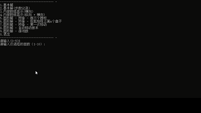
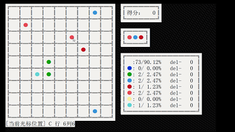
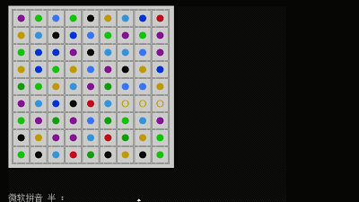
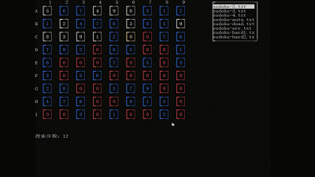
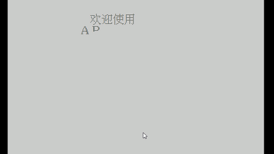
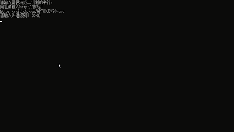

# 90-cpp

90-cpp is a series of funny C programming projects using CMD as GUI. Although they are written in C++, most of them only contain the C language features. 

All the projects are written by myself in my first year of program learning. Beginners can easily understand the logic in these projects and learn how to handle with their first project.(The QRcode uses other's library)

Every projects contains divided small steps to show you how I finish each projects. 

This repository contains:

1. Keyboard controlled [Hanoi Tower Game](89-b1) with CMD user interface.
2. [Ball Game One](89-b2):use mouse to move the ball before there is no place to move.
3. [Ball Game Two](90-b1):get scores by exchanging the neighbour balls.
4. [Sudoku Game](90-b2) with CMD user interface.
5. [Clock Application](90-3) with CMD user interface.
6. [QR code](90-b4) with CMD user interface.


## Table of Contents

- [Platform](#Platform)
- [Install](#Install)
- [Introduction](#Introduction)
    - [Hanoi Tower Game](#HanoiTowerGame)
    - [Ball Game One](#BallGameOne)
    - [Ball Game Two](#BallGameTwo)
    - [Sudoku Game](#SudokuGame)
    - [ClockApp](#ClockApp)
    - [QR code](#QRcode)
- [Maintainers](#Maintainers)
- [License](#License)

## Platform

These project uses windows api, so if you want to run these projects, make sure you have install Visual Studio on your Windows PC.

My platform is VS2017 and WIN10 1903.

## Install

Click 90.sln then Visual Studio will get things done.

Setting up a startup project.

If you have compile errors, like:
```CMD
(Win32): 已加载“C:\Windows\System32\ntdll.dll”。无法查找或打开 PDB 文件。
```
Please add Microsoft Symbol Server in your Visual Studio settings.

## Introduction
### HanoiTowerGame

Hanoi Tower Game is a CMD veriosn of traditional Hanio Tower realized in C language.

There are serveal modes in this project.

Users can choose how tall the Hanoi Towers are and the program will show you how to finish the game.




### BallGameOne

BallGameOne is a CMD veriosn of Ball Game realized in C language.

Users can use mouse click to control the game. You can remove five balls or above in single line to get score.

You have to use old CMD and cancel the insert mode in the CMD settings.



### BallGameTwo

BallGameTwo is a CMD veriosn of Ball Game realized in C language.

Users can use mouse click to exchange neighbour balls. You can remove five balls or above in single line to get score.

You have to use old CMD and cancel the insert mode in the CMD settings.



### SudokuGame

BallGameTwo is a CMD veriosn of Sudoku realized in C language.

Users can use mouse click and keyboard to exchange numbers.

There is also an suto mode.

You have to use old CMD and cancel the insert mode in the CMD settings.



### ClockApp

ClockApp is a CMD veriosn of Clock realized in C language.

Users can use keyboard to control the clock.



### QRcode

QRcode is a CMD veriosn of QRcode realized in C language.

You can enter a link into the CMD.



## Maintainers

[@APTXOUS](https://github.com/APTXOUS).

## License

[MIT](LICENSE) 
